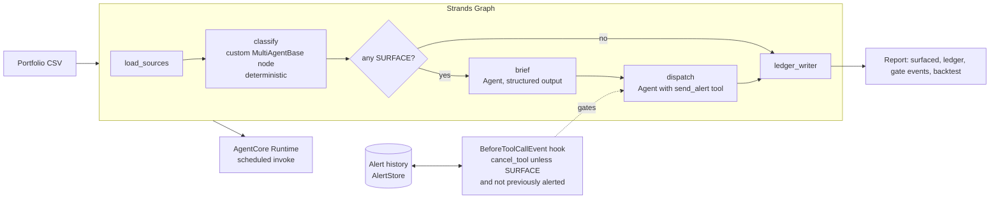

# Kizashi

A background agent, built with the Strands Agents SDK, that watches the public IRS filing record for a portfolio of small nonprofits and surfaces only the ones on the statutory path to automatic revocation of tax-exempt status, with the date it happens and the evidence. Every organization it stays silent on is written to a ledger with the reason.

Built for the AWS Agents for Humans Hackathon, Good Neighbor track. Created during the submission period; no pre-existing code.

## The rule it watches

An exempt organization that fails to file its annual return or notice for three consecutive years loses its exemption automatically, effective on the due date of the third return. There is no hearing and no advance notice. The IRS publishes the revocations months later. Small all-volunteer organizations, the ones a community foundation or fiscal sponsor funds by the hundred, are the ones this happens to.

Kizashi computes the date from the public record instead of waiting for the list.

## What it does

1. Loads three public IRS bulk files: the Exempt Organizations Business Master File, the Form 990-N e-Postcard download, and the Automatic Revocation List.
2. For every organization in a portfolio, finds the last return on record, projects the next three due dates, counts how many have already passed, and computes the date revocation becomes automatic.
3. Applies exclusions a person would apply: group-ruling subordinates, churches, terminated organizations, organizations that are not 990-N filers, organizations already on the revocation list, organizations that were reinstated.
4. Writes one ledger row per organization with its class and the reason it was, or was not, surfaced.
5. For the few that are surfaced, a Strands agent writes a brief and an outreach note from the evidence, and adds a review note only when the record itself suggests a person should check first (a name that reads as a local or auxiliary of a national body that may file for it under a group return, or a change of tax year between filings).
6. A second agent dispatches: `send_alert` when there is no review note, `hold_for_review` when there is one. A deterministic hook on `send_alert` cancels any alert whose organization is not in the surfaced class, whose date does not match the record, or which has already been sent or dismissed. Every send, hold and cancellation is logged with its reason.
7. `send_alert` delivers through Amazon SES (`sesv2` `SendEmail`) when `KIZASHI_SES_FROM`, `KIZASHI_SES_TO` and `KIZASHI_SES_SEND=1` are all set, and otherwise records a dry-run delivery id. The gate feed and the alert history carry the channel and the delivery id either way. The SES path is exercised by a stubbed `sesv2` client in the tests; no run in this repository has sent a real email.

## Built with Strands Agents SDK

- `strands.multiagent.GraphBuilder` assembles the pipeline: a custom `MultiAgentBase` node runs the deterministic classifier and never calls a model, then a brief agent with pydantic structured output, then a dispatch agent that owns the `send_alert` tool.
- `strands.hooks.BeforeToolCallEvent` is the gate. It reads the ledger and the alert history and sets `cancel_tool` with a reason string when the call is not allowed, and records a `hold_for_review` call as a third decision, "held", without writing alert history. `AfterToolCallEvent` records the sends with their delivery id.
- The model is served by Amazon Bedrock through the Mantle endpoint, using the `OpenAIModel` provider with `bedrock_mantle_config`, which mints a short-term Bedrock API key per request from the AWS session. The default model is `google.gemma-4-31b`.
- The runtime entrypoint is a `BedrockAgentCoreApp`, invoked at `/invocations` with a portfolio path and an as-of date.

## Architecture




## Run it

```bash
uv sync --extra dev
uv run kizashi fetch
uv run kizashi portfolio --state NJ --zip3 086 --out data/demo/portfolio-nj-086.csv
uv run kizashi classify --portfolio data/demo/portfolio-nj-086.csv --out data/runs/
uv run kizashi backtest --out data/runs/backtest.json
uv run kizashi score --as-of 2024-09-12 --out data/runs/silence.json
uv run kizashi run --portfolio data/demo/portfolio-nj-086.csv --out data/runs/
uv run kizashi serve --port 8000
uv run python src/kizashi/runtime_app.py
```

`classify` is the deterministic pass with no model. `score` reruns it at a past date with later revocations hidden and reports the outcome by class. `run` adds the brief agent, the dispatch agent and the gate. `serve` exposes the API and the built web app. The last line runs the AgentCore runtime contract locally on port 8080.

Web app:

```bash
cd web && pnpm install && pnpm dev
```

The landing page is at `/`, the dashboard at `/app`. Tests: `uv run pytest -q`.

## Backtest

`uv run kizashi backtest` over revocations dated 2021-01-01 to 2026-12-31, joined to the 990-N file, with 2020 excluded and refiled rows dropped: n=152249, exact=133844, exact_rate=0.8791, same_month=133844, same_month_rate=0.8791. Source file dates: revocation list 2026-09-11, 990-N file 2026-09-07.

The residual is not noise. The histogram of actual minus predicted, in months and clamped to plus or minus 24, has three spikes away from zero: +24 or more (8631 rows) and +12 (4194 rows), organizations the IRS revoked one or more filing years later than the postcard record implies, usually because a later 990 or 990-EZ is not in the postcard file; and -24 or less (4192 rows), organizations whose last postcard on record postdates an earlier revocation. All three are labelled in the web app's histogram.

Coverage, from the same run: 328308 revocations dated in the window; 152249 scored because a 990-N postcard predating the revocation is on record; 20113 dropped because the latest postcard postdates the revocation; 155946 not scored because the organization has no postcard in the file at all. The unscored half is the population the classifier reaches through the Business Master File tax period or the ruling date, and the date match above says nothing about those paths.

## Scoring the silence

`uv run kizashi score --as-of 2024-09-12` reruns the classifier over every 990-N filer in the region-1 Business Master File (130601 organizations) as of that date, with every revocation dated after it hidden from the classifier, and compares the result with what the IRS has posted through 2026-09-11. Only the surfaced class counts as a prediction, because it is the only class the gate lets an alert through for.

Of the 135 organizations it would have surfaced in September 2024, 105 were revoked in the two years since (77.8%) and 30 are still standing. The IRS posted 529 revocations in that window for organizations still in the file; surfacing caught 19.8% of them, or 31.3% after setting aside the 194 that filed again after the revocation, which the latest-only postcard file cannot show. Outcome by class as of the scoring date: surfaced 135 with 105 revoked; watch 276 with 33; current 106202 with 384; past due 177 with 3; never filed 11 with 2; excluded 23385 with 2.

The bias runs one way: an organization that filed since would not look delinquent in today's file, so precision is flattered, and recall is conditional on the organization still being in the Business Master File. Most watch and current rows revoked since had not yet missed two returns when this was scored, which is the design, not a miss.

## Demo portfolio

`uv run kizashi portfolio --state NJ --zip3 086` then `uv run kizashi classify --portfolio data/demo/portfolio-nj-086.csv --as-of 2026-09-12`, 886 EINs: surface=38, watch=151, current=456, excluded=215, dead=11, reinstated=99, never_filed=14, past_due=1, alerts_sent=0, alerts_suppressed=0.

## Live run with the model and the gate

`KIZASHI_DEMO_FORCE_EIN=010579647 uv run kizashi run --portfolio data/demo/portfolio-nj-086.csv --name "Mercer County NJ small nonprofits"` on 2026-09-11 with a fresh alert history, model `google.gemma-4-31b` on Bedrock Mantle in us-east-1: briefs model=38 fallback=0; alerts_sent=38, alerts_suppressed=1. The suppressed one is the forced negative control, cancelled by the hook with `class=WATCH, not an alert condition`. A second run over the same portfolio without clearing the alert history yields alerts_sent=0 and alerts_suppressed=38, each cancelled with `already alerted for <date>`. This run is the report the web app ships with.

## Runtime

`uv run python src/kizashi/runtime_app.py` starts the AgentCore runtime contract locally on port 8080; `POST /invocations` with `{"portfolio_csv": "data/demo/portfolio-nj-086.csv", "with_model": false}` returns the run summary. Deploying it to a hosted AgentCore Runtime is blocked on this AWS account by a zero agents-per-account quota, so the hosted step is not part of this submission.

## Source agreement

`uv run kizashi reconcile`, BMF `TAX_PERIOD` against the last 990-N `Tax Period End` for `eo1.csv` filing-requirement-02 organizations: agree=97114, bmf_later=6639, postcard_later=1107, one_missing=25741.

## Data handling

Public organizational data only. The 990-N file's principal-officer name and address fields are never read into memory, never rendered, and never sent to a model. No credentials, no scraping behind a login. The only outbound side effect is an alert message: SES when three environment variables opt in, a dry-run record otherwise, and the hook owns that gate either way. Alert text states what is on the record and the statutory date; it does not give tax advice. Every report carries the source file dates so a reader can see how stale the record is.

## License

MIT.
